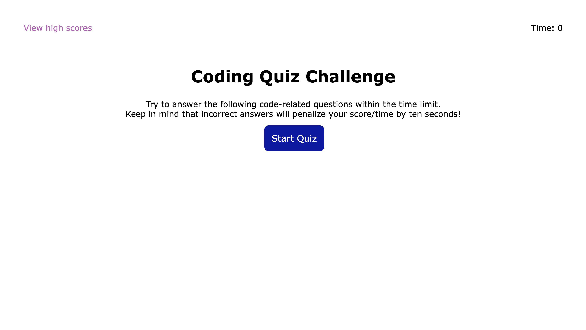
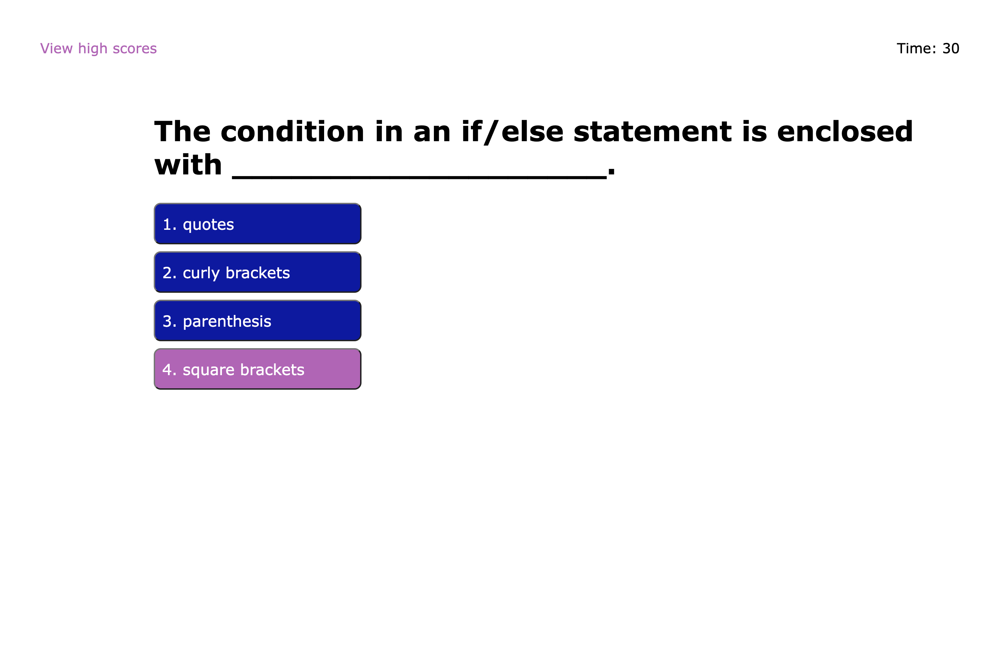
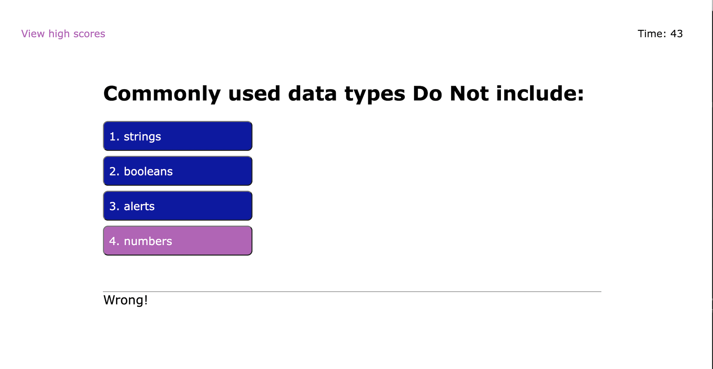
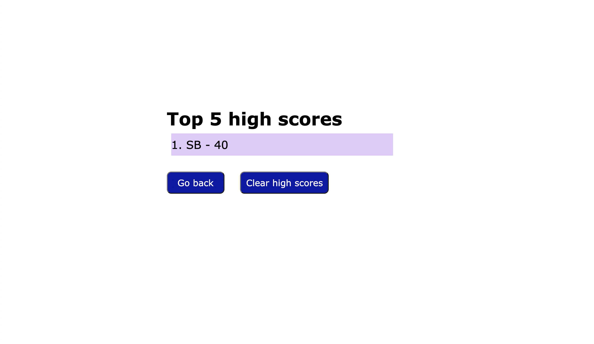

# Code Quiz

In this project, I wrote code for a timed quiz about certain web coding related concepts.  The user had to answer 5 questions within one minute, and received a deduction of ten seconds for each wrong answer.  The user's score was equal to the number of seconds remaining at the end of the quiz. The project included responsive styling, dynamically created html using JavaScript, and persistence of top scores using local storage.  

## Deployment

Code Quiz has been deployed here: https://greenmanaustin.github.io/code-quiz/

These screenshots show the various aspects of Code Quiz:

## Skills Learned

I learned and/or honed the following skills:
 - create a website from scratch using html, css and JavaScript
 - dynamically create html using JavaScript
 - create modular code with simple functions
 - use local storage to obtain data persistence 
 - use objects and arrays of objects to make data management simplier
 - sort arrays of objects using key values
 - improve user functionality over many iterations
 - create increasing complex websites using wireframing, pseudo code, and constant testing

